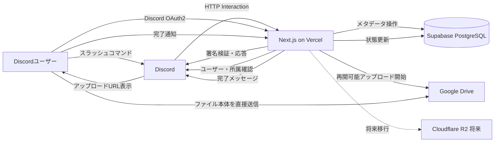
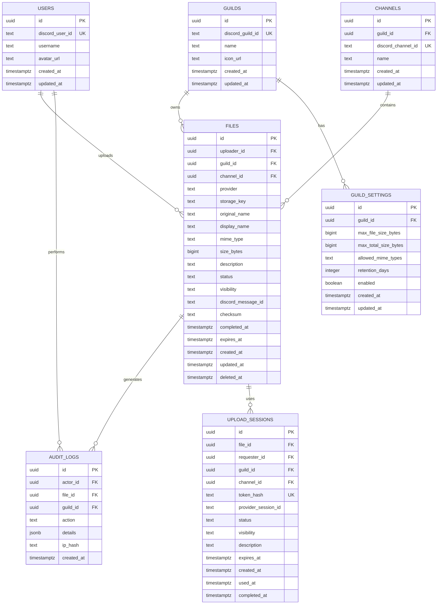

# Discord Cloud File Bot 設計書・構築手順

- 文書バージョン: 1.0
- 作成日: 2026-06-22
- 想定ステータス: MVP設計
- 言語: TypeScript
- Webフレームワーク: Next.js App Router
- ホスティング: Vercel
- Discord連携: HTTP Interactions
- 認証: Discord OAuth2
- データベース: Supabase PostgreSQL
- 初期ストレージ: Google Drive
- 将来ストレージ: Cloudflare R2

---

## 1. 概要

本システムは、Discordのファイル添付容量制限を回避し、Discordを操作画面として大容量ファイルを共有・管理するためのWebアプリケーションである。

利用者はDiscord上で `/upload` コマンドを実行し、Botが発行した一時的なアップロードURLを開く。アップロード画面ではDiscord OAuth2によって本人確認を行い、利用者が所属するDiscordサーバーと権限を確認したうえで、ファイルをGoogle Driveへ保存する。

アップロード完了後、Discordのチャンネルへファイル名、容量、投稿者、詳細表示ボタン、Google Driveで開くボタンなどを含むメッセージを送信する。R2移行後は、一時ダウンロードURLを利用したダウンロードボタンへ拡張する。

ファイル本体はGoogle Driveに保存し、Supabase PostgreSQLにはファイル管理に必要なメタデータのみを保存する。

---

## 2. 目的

### 2.1 解決する課題

- Discordの添付ファイル容量制限により、大容量動画や制作物を共有しにくい
- Google Driveへ手動でアップロードし、リンクをDiscordへ貼る作業が面倒
- ファイルとDiscord投稿者・投稿先チャンネルの対応を管理しにくい
- 共有リンクが外部へ流出した場合のアクセス制御が難しい
- 保存期限、削除、検索、容量管理をDiscord上から行いたい

### 2.2 目標

- Discordのスラッシュコマンドからアップロードを開始できる
- 大容量ファイルをVercel Functionsへ中継せずに保存できる
- Discordユーザーとアップロードファイルを紐付けられる
- Discordサーバー単位、チャンネル単位でアクセス権限を管理できる
- 将来的にGoogle DriveからCloudflare R2へ移行できる
- 保存先に依存しないストレージ抽象化を実装する

---

## 3. スコープ

### 3.1 MVPで実装する機能

1. Discord HTTP Interactionsの受信
2. Discordリクエスト署名検証
3. `/upload` コマンド
4. 一時アップロードURLの発行
5. Discord OAuth2ログイン
6. Discordサーバー所属確認
7. `/upload` 実行者とWebログインユーザーの照合
8. Google Driveへのファイルアップロード
9. Supabaseへのメタデータ保存
10. Discordへのアップロード完了通知
11. 認証済みユーザー向けのファイル詳細表示
12. Google Driveプレビューへの誘導
13. 投稿者による削除
14. 操作ログの保存
15. アップロード容量・拡張子の制限

MVPでは、チャンネル単位の厳密な権限判定、一覧検索、管理者削除、本格的な一時ダウンロードURL発行は第2段階へ回す。

### 3.2 MVPでは実装しない機能

- Discord Gatewayへの常時接続
- 通常メッセージの監視
- ボイスチャンネル連携
- 動画の自動変換・トランスコード
- CDNによる大規模配信
- 全文検索
- ウイルススキャン基盤
- 複数Googleアカウントの切り替え
- 課金機能
- Cloudflare R2への実保存
- `/files` による一覧検索
- `/quota` による容量表示
- チャンネルPermission Overwriteを含む厳密な権限判定
- Driveファイルの本格的な一時ダウンロードURL発行

### 3.3 将来機能

- Cloudflare R2への移行
- 保存先のサーバー別選択
- ファイルの保存期限
- 自動削除
- サムネイル生成
- 動画ストリーミング
- 管理画面
- アップロード利用量のグラフ
- ファイルタグ
- フォルダ分類
- 全文検索
- ウイルススキャン
- 監査ログ出力
- サーバーごとの容量プラン
- `/files`
- `/quota`
- 管理者による削除
- チャンネル単位の厳密な閲覧制御

---

## 4. システム構成



---

## 5. 重要な設計判断

### 5.1 Discord Gatewayを使用しない

本システムはDiscord Gatewayへ常時接続せず、Discord Developer Portalに設定したInteractions Endpoint URLでスラッシュコマンドやボタン操作を受信する。

これにより、常駐プロセスを必要とせず、Vercel Functions上で運用できる。

### 5.2 大容量ファイルをVercel Functionsへ送らない

Vercel Functionsにはリクエスト・レスポンスのペイロード制限があるため、ファイル本体を次の経路で送信してはならない。

```text
ブラウザ → Vercel Function → Google Drive
```

代わりに、VercelはGoogle Driveの再開可能アップロードセッションを開始し、そのアップロード先URLをブラウザへ返す。

```text
ブラウザ → Google Drive
```

Vercelが扱うのは、認証情報、ファイル名、MIMEタイプ、容量、DriveファイルID、進捗状態などの小さなデータのみとする。

### 5.3 ストレージを抽象化する

Google Drive固有の処理を画面やAPI Routeへ直接記述せず、`StorageProvider` インターフェースの実装として分離する。

```ts
export interface StorageProvider {
  createUploadSession(input: CreateUploadSessionInput): Promise<UploadSession>;
  getDownload(input: GetDownloadInput): Promise<DownloadResult>;
  deleteObject(storageKey: string): Promise<void>;
  getMetadata(storageKey: string): Promise<StoredObjectMetadata>;
}
```

初期実装:

```ts
export class GoogleDriveStorageProvider implements StorageProvider {
  // Google Drive APIを利用する
}
```

将来実装:

```ts
export class CloudflareR2StorageProvider implements StorageProvider {
  // S3互換APIと署名付きURLを利用する
}
```

---

## 6. ユースケース

### 6.1 ファイルをアップロードする

1. ユーザーがDiscordで `/upload` を実行する
2. DiscordがVercelのInteractions Endpointへリクエストする
3. サーバーがDiscord署名を検証する
4. サーバーが有効期限付きアップロードトークンを生成する
5. Botがアップロードボタンを表示する
6. ユーザーがボタンを押してWeb画面を開く
7. 未ログインの場合はDiscord OAuth2を実行する
8. サーバー所属とチャンネル権限を検証する
9. ユーザーがファイルを選択する
10. APIがGoogle Driveの再開可能アップロードセッションを開始する
11. ブラウザがGoogle Driveへ直接アップロードする
12. ブラウザが完了APIを呼び出す
13. APIがDrive上のファイル情報を検証する
14. Supabaseのレコードを `completed` に変更する
15. Discordへ完了メッセージを投稿する

### 6.2 ファイルを閲覧する

1. ユーザーがDiscordの「閲覧」ボタンを押す
2. Web画面へ遷移する
3. Discord OAuth2セッションを確認する
4. ユーザーのサーバー所属とアクセス権を確認する
5. ファイル詳細画面を表示する
6. MVPでは、必要に応じて短時間だけDriveの共有リンクを有効化し、Google Driveプレビューへ誘導する
7. 共有リンクを有効化した場合は、失効処理または定期処理で共有状態を戻す

### 6.3 ファイルをダウンロードする

MVPでは、大容量ファイルのダウンロードをVercel経由で中継しない。

1. ユーザーが「閲覧」または「Driveで開く」ボタンを押す
2. Discord OAuth2セッションを確認する
3. ファイルへのアクセス権を確認する
4. Google Driveプレビュー画面へ誘導する
5. Drive側でユーザーがダウンロードできる場合のみ、Drive UIからダウンロードする

注意: Google DriveではR2のような一般的な署名付きオブジェクトURLを発行する方式とは異なるため、初期版では次のいずれかを選ぶ。

- Driveの共有設定を限定的に変更してリンクを返す
- 認証済みサーバー経由でダウンロードを中継する
- Google Driveのプレビュー画面へ遷移させる

大容量ダウンロードをVercelで中継すると制限や転送コストの問題があるため、MVPでは「Google Driveプレビューを開く」を基本とする。R2移行後にPresigned GET URLによる本格的なダウンロードを実装する。

### 6.4 ファイルを削除する

1. MVPでは投稿者本人がWeb画面から削除操作を行う
2. 対象ファイルの権限を確認する
3. DBの状態を `deleting` に変更する
4. Google Driveのファイルを削除する
5. DBを `deleted` に更新する
6. Discordの投稿を更新または削除する
7. 操作ログを保存する

管理者による削除、Discord上の `/delete` コマンド、詳細なDiscord権限判定はPhase 2で実装する。

---

## 7. 画面設計

### 7.1 トップページ

URL:

```text
/
```

表示内容:

- サービス名
- Discordで利用する方法
- Discordログインボタン
- プライバシーポリシー
- 利用規約
- ログイン済みユーザー情報

### 7.2 アップロードページ

URL:

```text
/upload/[token]
```

表示内容:

- 対象Discordサーバー
- 対象チャンネル
- 投稿者
- ファイル選択
- ファイル名
- 説明
- アクセス範囲
- アップロード進捗
- 中断・再試行
- 完了結果

### 7.3 ファイル詳細ページ

URL:

```text
/files/[fileId]
```

表示内容:

- ファイル名
- 投稿者
- 投稿日時
- サイズ
- MIMEタイプ
- 説明
- Discordサーバー・チャンネル
- 詳細情報
- Driveで開くボタン
- 投稿者向け削除ボタン
- 保存状態

### 7.4 管理画面

MVP後に実装する。

URL:

```text
/admin
```

表示候補:

- ファイル一覧
- サーバー別使用量
- ユーザー別使用量
- 操作ログ
- 削除済みファイル
- アップロード制限設定

---

## 8. Discordコマンド設計

### 8.1 `/upload`

目的:

アップロード用URLを発行する。

オプション例:

| 名前 | 型 | 必須 | 説明 |
|---|---|---:|---|
| description | string | いいえ | ファイルの説明 |
| visibility | string | いいえ | channel / guild / uploader |
| expires | integer | いいえ | 保存日数 |

応答例:

```text
ファイルアップロードの準備ができました。
このリンクは15分間有効です。

[ファイルをアップロード]
```

アップロードURLは実行者だけに見えるEphemeral Messageで返す。

### 8.2 `/files`

Phase 2で実装する。

目的:

現在のサーバーまたはチャンネルに紐付くファイルを表示する。

オプション例:

| 名前 | 型 | 必須 | 説明 |
|---|---|---:|---|
| query | string | いいえ | ファイル名検索 |
| mine | boolean | いいえ | 自分の投稿のみ |
| page | integer | いいえ | ページ番号 |

### 8.3 `/file`

Phase 2で実装する。MVPではDiscord投稿のボタンからWebのファイル詳細ページへ遷移する。

目的:

指定ファイルの詳細を表示する。

### 8.4 `/delete`

Phase 2で実装する。MVPではWebのファイル詳細ページから投稿者本人が削除する。

目的:

自分が投稿したファイル、または管理権限を持つファイルを削除する。

### 8.5 `/quota`

Phase 2で実装する。

目的:

現在のサーバーで利用中の容量、制限、ファイル数を表示する。

---

## 9. Discord Interaction API設計

### 9.1 Endpoint

```text
POST /api/discord/interactions
```

### 9.2 必須処理

1. 生のリクエスト本文を取得
2. 以下のヘッダーを取得
   - `X-Signature-Ed25519`
   - `X-Signature-Timestamp`
3. Discord Application Public Keyで署名検証
4. 不正な場合はHTTP 401
5. PINGの場合はPONGを返す
6. コマンド種別に応じて処理する
7. Discordが要求する時間内に応答する

### 9.3 署名検証例

```ts
import nacl from "tweetnacl";

export function verifyDiscordRequest(
  body: string,
  signature: string,
  timestamp: string,
  publicKey: string,
): boolean {
  return nacl.sign.detached.verify(
    Buffer.from(timestamp + body),
    Buffer.from(signature, "hex"),
    Buffer.from(publicKey, "hex"),
  );
}
```

### 9.4 Route Handler例

```ts
import { NextRequest, NextResponse } from "next/server";
import { verifyDiscordRequest } from "@/lib/discord/verify";

export const runtime = "nodejs";

export async function POST(request: NextRequest) {
  const signature = request.headers.get("x-signature-ed25519");
  const timestamp = request.headers.get("x-signature-timestamp");
  const body = await request.text();

  if (!signature || !timestamp) {
    return new NextResponse("Missing signature", { status: 401 });
  }

  const verified = verifyDiscordRequest(
    body,
    signature,
    timestamp,
    process.env.DISCORD_PUBLIC_KEY!,
  );

  if (!verified) {
    return new NextResponse("Invalid signature", { status: 401 });
  }

  const interaction = JSON.parse(body);

  if (interaction.type === 1) {
    return NextResponse.json({ type: 1 });
  }

  // Application Command
  if (interaction.type === 2 && interaction.data?.name === "upload") {
    return NextResponse.json({
      type: 4,
      data: {
        flags: 64,
        content: "アップロードURLを準備しています。",
      },
    });
  }

  return NextResponse.json({
    type: 4,
    data: {
      flags: 64,
      content: "未対応の操作です。",
    },
  });
}
```

---

## 10. Discord OAuth2設計

### 10.1 使用目的

Discord OAuth2は、WebページへアクセスしたユーザーがDiscord上の誰であるかを確認するために使用する。

### 10.2 必要なScope

基本:

```text
identify
guilds
```

必要に応じて追加:

```text
guilds.members.read
```

Botのインストールには別途以下を利用する。

```text
bot
applications.commands
```

### 10.3 OAuth2フロー

1. ユーザーがアップロードページへアクセス
2. セッションがなければDiscord認可画面へ遷移
3. Discordから認可コードを受け取る
4. サーバー側でアクセストークンへ交換
5. `/users/@me` でDiscordユーザー情報を取得
6. `/users/@me/guilds` で所属サーバーを取得
7. 暗号化されたHTTP Only Cookieまたは認証ライブラリのセッションへ保存
8. アップロードトークンのDiscordユーザーIDと照合

### 10.4 認証方式の選択

推奨案:

- Auth.jsでDiscord Providerを利用する
- DBセッションを使用する
- Supabaseは主にPostgreSQLとして利用する

代替案:

- Supabase AuthのDiscord Providerを使用する

本設計では、Discord APIのトークンを使ったサーバー所属確認を行いやすくするため、Auth.jsを推奨する。MVPでは実装を単純にするためJWTセッションも選択できるが、Discord Refresh TokenをJWT Cookieへ長期保存する構成は避ける。長期的な運用では、DBセッションと暗号化済みアカウントトークン保存へ寄せる。

### 10.5 トークン管理

- Discordアクセストークンをブラウザへ返さない
- リフレッシュトークンを平文でDBへ保存しない
- 保存が必要な場合はアプリケーション側で暗号化する
- JWTセッションを使う場合、Refresh Tokenは保存しないか、短期検証用途に限定する
- Discord API呼び出しに必要なAccess Tokenが期限切れの場合は、再ログインを要求する
- Cookieは `HttpOnly`、`Secure`、`SameSite=Lax` 以上
- OAuth `state` を必ず検証する
- PKCEを利用できる構成では利用する

---

## 11. データベース設計

### 11.1 ER図



### 11.2 Enum相当の値

`files.provider`

```text
google_drive
cloudflare_r2
```

`files.status`

```text
pending
uploading
verifying
completed
failed
deleting
deleted
```

`files.visibility`

```text
uploader
channel
guild
```

`upload_sessions.status`

```text
created
uploading
completed
expired
cancelled
failed
```

### 11.3 SQL初期スキーマ

```sql
create extension if not exists pgcrypto;

create table public.users (
  id uuid primary key default gen_random_uuid(),
  discord_user_id text not null unique,
  username text not null,
  avatar_url text,
  created_at timestamptz not null default now(),
  updated_at timestamptz not null default now()
);

create table public.guilds (
  id uuid primary key default gen_random_uuid(),
  discord_guild_id text not null unique,
  name text not null,
  icon_url text,
  created_at timestamptz not null default now(),
  updated_at timestamptz not null default now()
);

create table public.channels (
  id uuid primary key default gen_random_uuid(),
  guild_id uuid not null references public.guilds(id) on delete cascade,
  discord_channel_id text not null unique,
  name text not null,
  created_at timestamptz not null default now(),
  updated_at timestamptz not null default now()
);

create table public.files (
  id uuid primary key default gen_random_uuid(),
  uploader_id uuid not null references public.users(id),
  guild_id uuid not null references public.guilds(id),
  channel_id uuid not null references public.channels(id),
  provider text not null check (provider in ('google_drive', 'cloudflare_r2')),
  storage_key text,
  original_name text not null,
  display_name text not null,
  mime_type text not null,
  size_bytes bigint not null check (size_bytes >= 0),
  description text,
  status text not null default 'pending'
    check (status in (
      'pending',
      'uploading',
      'verifying',
      'completed',
      'failed',
      'deleting',
      'deleted'
    )),
  visibility text not null default 'channel'
    check (visibility in ('uploader', 'channel', 'guild')),
  discord_message_id text,
  checksum text,
  completed_at timestamptz,
  expires_at timestamptz,
  created_at timestamptz not null default now(),
  updated_at timestamptz not null default now(),
  deleted_at timestamptz
);

create index files_guild_id_idx on public.files(guild_id);
create index files_channel_id_idx on public.files(channel_id);
create index files_uploader_id_idx on public.files(uploader_id);
create index files_status_idx on public.files(status);
create index files_created_at_idx on public.files(created_at desc);

create table public.upload_sessions (
  id uuid primary key default gen_random_uuid(),
  file_id uuid references public.files(id) on delete set null,
  requester_id uuid not null references public.users(id),
  guild_id uuid not null references public.guilds(id) on delete cascade,
  channel_id uuid not null references public.channels(id) on delete cascade,
  token_hash text not null unique,
  provider_session_id text,
  status text not null default 'created'
    check (status in (
      'created',
      'uploading',
      'completed',
      'expired',
      'cancelled',
      'failed'
    )),
  visibility text not null default 'channel'
    check (visibility in ('uploader', 'channel', 'guild')),
  description text,
  expires_at timestamptz not null,
  created_at timestamptz not null default now(),
  used_at timestamptz,
  completed_at timestamptz
);

create index upload_sessions_file_id_idx
  on public.upload_sessions(file_id);

create index upload_sessions_requester_id_idx
  on public.upload_sessions(requester_id);

create index upload_sessions_guild_channel_idx
  on public.upload_sessions(guild_id, channel_id);

create index upload_sessions_expires_at_idx
  on public.upload_sessions(expires_at);

create table public.guild_settings (
  id uuid primary key default gen_random_uuid(),
  guild_id uuid not null unique references public.guilds(id) on delete cascade,
  max_file_size_bytes bigint not null default 2147483648,
  max_total_size_bytes bigint not null default 10737418240,
  allowed_mime_types text[] not null default array[
    'video/mp4',
    'video/webm',
    'image/png',
    'image/jpeg',
    'application/pdf',
    'application/zip'
  ],
  retention_days integer,
  enabled boolean not null default true,
  created_at timestamptz not null default now(),
  updated_at timestamptz not null default now()
);

create table public.audit_logs (
  id uuid primary key default gen_random_uuid(),
  actor_id uuid references public.users(id),
  file_id uuid references public.files(id),
  guild_id uuid references public.guilds(id),
  action text not null,
  details jsonb not null default '{}'::jsonb,
  ip_hash text,
  created_at timestamptz not null default now()
);

create index audit_logs_file_id_idx on public.audit_logs(file_id);
create index audit_logs_guild_id_idx on public.audit_logs(guild_id);
create index audit_logs_created_at_idx on public.audit_logs(created_at desc);

create or replace function public.set_updated_at()
returns trigger
language plpgsql
as $$
begin
  new.updated_at = now();
  return new;
end;
$$;

create trigger users_set_updated_at
  before update on public.users
  for each row execute function public.set_updated_at();

create trigger guilds_set_updated_at
  before update on public.guilds
  for each row execute function public.set_updated_at();

create trigger channels_set_updated_at
  before update on public.channels
  for each row execute function public.set_updated_at();

create trigger files_set_updated_at
  before update on public.files
  for each row execute function public.set_updated_at();

create trigger guild_settings_set_updated_at
  before update on public.guild_settings
  for each row execute function public.set_updated_at();
```

`upload_sessions.file_id` は `/upload` 実行直後は `null` のままとし、ファイル選択後にアップロードセッション開始APIで `files` レコードを作成して紐付ける。これにより、ファイル未選択の一時URLと、実際に作成されたファイルメタデータを分離できる。

一覧表示や容量集計では、原則として `files.status = 'completed'` かつ `deleted_at is null` のレコードのみを対象にする。アップロード途中、失敗、削除済みのレコードを含める場合は、管理画面や監査用途として明示的に扱う。

容量集計例:

```sql
select
  guild_id,
  coalesce(sum(size_bytes), 0) as used_bytes
from public.files
where status = 'completed'
  and deleted_at is null
group by guild_id;
```

### 11.4 RLS方針

Next.jsのサーバー専用処理からService RoleまたはSecret Keyを使用する場合でも、クライアント側へ秘密鍵を公開してはならない。

ブラウザからSupabaseへ直接アクセスさせる場合はRLSを有効にする。

```sql
alter table public.users enable row level security;
alter table public.guilds enable row level security;
alter table public.channels enable row level security;
alter table public.files enable row level security;
alter table public.upload_sessions enable row level security;
alter table public.guild_settings enable row level security;
alter table public.audit_logs enable row level security;
```

MVPでは、重要なDB操作をNext.jsサーバー側へ集約し、ブラウザへService Roleキーを渡さない。

---

## 12. API設計

### 12.1 Discord Interaction

```text
POST /api/discord/interactions
```

役割:

- 署名検証
- PING応答
- コマンド処理
- ボタン・モーダル処理

### 12.2 OAuth開始

```text
GET /api/auth/signin/discord
```

Auth.jsを使用する場合はライブラリのルートを利用する。

### 12.3 アップロード情報取得

```text
GET /api/uploads/[token]
```

処理:

- トークン検証
- 有効期限確認
- ログインユーザー照合
- ギルド・チャンネル情報返却

### 12.4 アップロードセッション開始

```text
POST /api/uploads/[token]/session
```

リクエスト:

```json
{
  "fileName": "movie.mp4",
  "mimeType": "video/mp4",
  "sizeBytes": 734003200,
  "description": "ライブ映像"
}
```

レスポンス:

```json
{
  "fileId": "uuid",
  "uploadUrl": "https://www.googleapis.com/upload/drive/v3/files?...",
  "expiresAt": "2026-06-22T12:00:00.000Z"
}
```

サーバー処理:

1. トークン検証
2. 有効期限、状態、投稿者を確認
3. 容量、MIMEタイプ、拡張子、サーバー設定を検証
4. `files` レコードを `uploading` で作成
5. `upload_sessions.file_id`、`provider_session_id`、`used_at`、`status` を更新
6. Google Driveの再開可能アップロードURLを返す

注意:

`uploadUrl` は機密性の高い一時URLとして扱い、ログへ完全な値を残さない。

### 12.5 アップロード完了

```text
POST /api/uploads/[token]/complete
```

リクエスト:

```json
{
  "fileId": "uuid",
  "driveFileId": "google-drive-file-id"
}
```

サーバー処理:

1. トークン検証
2. 投稿者照合
3. Drive APIでファイル存在確認
4. ファイル名、MIME、容量を照合
5. DB更新
6. Discordへ完了メッセージ投稿
7. 操作ログ保存

### 12.6 ファイル詳細

```text
GET /api/files/[fileId]
```

### 12.7 ファイル削除

```text
DELETE /api/files/[fileId]
```

### 12.8 ダウンロード

```text
GET /api/files/[fileId]/download
```

MVPではこのAPIを本格的なバイナリダウンロードには使わない。アクセス権確認後、Google Driveプレビューまたは短時間だけ有効化したDrive共有リンクへリダイレクトする。R2移行後はPresigned GET URLを返す実装へ切り替える。

---

## 13. Google Drive設計

### 13.1 認証方式

MVPでは、運営者のGoogleアカウントをOAuth 2.0で接続する方式を推奨する。

理由:

- 個人のマイドライブへ保存できる
- サービスアカウント単体の保存容量設計を避けられる
- Drive APIの操作主体が明確になる

Google Workspaceを利用できる場合は共有ドライブも検討する。

### 13.2 保存フォルダ構造

```text
Discord Cloud File Bot
└── guild-{discord_guild_id}
    └── channel-{discord_channel_id}
        └── {uuid}-{sanitized_file_name}
```

実際にはDriveフォルダIDをDBまたは設定値で管理する。

### 13.3 再開可能アップロード

1. サーバーがGoogle OAuthアクセストークンを取得する
2. `uploadType=resumable` でDrive APIへメタデータを送信する
3. レスポンスの `Location` ヘッダーからセッションURLを取得する
4. セッションURLをブラウザへ返す
5. ブラウザがファイルを直接PUTする
6. 完了後にDriveファイルIDを取得する
7. 完了APIへ報告する

### 13.4 ブラウザ側アップロード例

```ts
export async function uploadToDrive(
  uploadUrl: string,
  file: File,
  onProgress: (progress: number) => void,
): Promise<{ id: string }> {
  return await new Promise((resolve, reject) => {
    const xhr = new XMLHttpRequest();

    xhr.open("PUT", uploadUrl);
    xhr.setRequestHeader("Content-Type", file.type || "application/octet-stream");

    xhr.upload.onprogress = (event) => {
      if (!event.lengthComputable) return;
      onProgress(event.loaded / event.total);
    };

    xhr.onload = () => {
      if (xhr.status >= 200 && xhr.status < 300) {
        resolve(JSON.parse(xhr.responseText));
        return;
      }

      reject(
        new Error(`Upload failed: ${xhr.status} ${xhr.responseText}`),
      );
    };

    xhr.onerror = () => reject(new Error("Network error"));
    xhr.send(file);
  });
}
```

### 13.5 CORS確認

ブラウザからGoogle Driveの再開可能アップロードURLへ直接PUTする構成は、実装時にGoogle API側のCORS挙動を検証する。

Phase 0では、以下の条件をすべて満たした場合のみGoogle DriveをMVPの初期ストレージとして継続する。

- ブラウザから再開可能アップロードURLへ100 MB以上のPUTが成功する
- Vercel Functionにファイル本体が流れない
- 完了後にDrive File ID、ファイル名、MIMEタイプ、サイズをサーバー側で検証できる
- Google Driveプレビューまたは限定共有リンクの運用方針が成立する

CORSや認証制約により直接送信が成立しない場合は、Google Drive中心の構成を継続せず、次の順で切り替える。

1. Cloudflare R2を初期ストレージとして採用する
2. Google Cloud Storageを初期ストレージとして採用する
3. 専用の長時間稼働バックエンドをRailway、Render、Cloud Run等に配置する
4. Google Picker等を利用し、ユーザー自身のDriveへ保存する

この点は実装開始直後に小さな技術検証を行う。

### 13.6 ファイル共有権限

安全性優先の基本方針:

- Driveファイルを無条件に `anyone` 公開しない
- Webアプリ側でDiscordユーザーを認証する
- Discordサーバー・チャンネルへのアクセス権を確認する
- MVPでは必要な場合だけ閲覧用リンクを短時間有効化する
- 共有リンクを有効化した場合は `audit_logs` に記録する
- 共有リンクの失効処理を手動または定期処理で行う
- R2移行後はPresigned GET URLへ置き換える

---

## 14. アップロードトークン設計

### 14.1 目的

Discord上で `/upload` を実行したユーザーだけが、対応するアップロード画面を利用できるようにする。

### 14.2 トークン仕様

- 32バイト以上の暗号学的乱数
- URLには生トークンを含める
- DBにはSHA-256ハッシュのみ保存
- 有効期限は15分
- アップロードセッション開始は1回限り利用可能
- DiscordユーザーID、ギルドID、チャンネルIDと紐付ける
- 完了後は再利用不可

トークンは `upload_sessions.token_hash` に保存し、実行者は `requester_id`、対象サーバーは `guild_id`、対象チャンネルは `channel_id` に保存する。ファイル選択前は `file_id` を `null` とし、アップロードセッション開始時に作成した `files.id` を紐付ける。

### 14.3 生成例

```ts
import crypto from "node:crypto";

export function createUploadToken() {
  const rawToken = crypto.randomBytes(32).toString("base64url");
  const tokenHash = crypto
    .createHash("sha256")
    .update(rawToken)
    .digest("hex");

  return {
    rawToken,
    tokenHash,
  };
}
```

---

## 15. 権限設計

### 15.1 アップロード権限

- Botが対象Discordサーバーにインストールされている
- `/upload` 実行者とWebログインユーザーが一致する
- 対象サーバーに所属している
- 対象チャンネルでコマンドを実行できる
- サーバー設定が有効
- 容量上限を超えていない
- MIMEタイプが許可されている

### 15.2 閲覧権限

`visibility = uploader`

- 投稿者本人のみ

`visibility = channel`

- 対象チャンネルを閲覧できるユーザー

`visibility = guild`

- 対象Discordサーバーのメンバー

### 15.3 削除権限

以下のいずれか:

- 投稿者本人
- Discordの `Manage Messages` 権限
- Discordの `Administrator` 権限
- アプリ管理者

### 15.4 Discord権限の検証

OAuthで取得した所属情報だけではチャンネル単位の詳細権限が不足する場合がある。

正確なチャンネル権限判定が必要な場合は、Bot Tokenで以下の情報を取得し、ロールとPermission Overwriteを評価する。

- Guild Member
- Member Roles
- Guild Roles
- Channel Permission Overwrites

MVPでは次の簡易方式も選択できる。

- `/upload` を実行できた時点でアップロード権限を認める
- URLへ実行者IDを紐付ける
- 閲覧はDiscord投稿からのみ誘導する
- 詳細なチャンネル権限判定は第2段階で実装する

---

## 16. セキュリティ設計

### 16.1 必須対策

- Discord Interaction署名検証
- OAuth `state` 検証
- CSRF対策
- XSS対策
- SQLインジェクション対策
- ファイル名サニタイズ
- MIMEタイプと拡張子の両方を検査
- ファイル容量上限
- アップロードURLの短期失効
- トークンの一回利用
- レート制限
- 操作ログ
- 秘密情報の環境変数管理
- Service Roleキーをクライアントへ公開しない
- Google Refresh Tokenの暗号化
- エラー画面へ内部情報を表示しない
- 削除操作の再認証または確認

### 16.2 ファイル名サニタイズ例

```ts
export function sanitizeFileName(name: string): string {
  return name
    .normalize("NFKC")
    .replace(/[\/\\:*?"<>|]/g, "_")
    .replace(/\.\.+/g, ".")
    .trim()
    .slice(0, 180);
}
```

### 16.3 レート制限例

- `/upload`: 1ユーザーあたり5回 / 10分
- セッション開始: 1トークンあたり3回
- 完了API: 1ファイルあたり5回
- ファイル一覧: 1ユーザーあたり60回 / 分
- 削除: 1ユーザーあたり20回 / 時間

Upstash RedisやVercel Firewall等を利用できる。

### 16.4 ログに保存しないもの

- Discord Bot Token
- Discord OAuth Client Secret
- Discord Access Token
- Discord Refresh Token
- Google Access Token
- Google Refresh Token
- Supabase Secret Key
- Drive再開可能アップロードURL全文
- Cookie
- 生のアップロードトークン

---

## 17. ディレクトリ設計

```text
discord-cloud-file-bot/
├── app/
│   ├── api/
│   │   ├── auth/
│   │   │   └── [...nextauth]/
│   │   │       └── route.ts
│   │   ├── discord/
│   │   │   └── interactions/
│   │   │       └── route.ts
│   │   ├── uploads/
│   │   │   └── [token]/
│   │   │       ├── route.ts
│   │   │       ├── session/
│   │   │       │   └── route.ts
│   │   │       └── complete/
│   │   │           └── route.ts
│   │   └── files/
│   │       └── [fileId]/
│   │           ├── route.ts
│   │           └── download/
│   │               └── route.ts
│   ├── upload/
│   │   └── [token]/
│   │       └── page.tsx
│   ├── files/
│   │   └── [fileId]/
│   │       └── page.tsx
│   ├── layout.tsx
│   └── page.tsx
├── components/
│   ├── upload-form.tsx
│   ├── upload-progress.tsx
│   ├── file-card.tsx
│   └── sign-in-button.tsx
├── lib/
│   ├── auth/
│   │   ├── auth.ts
│   │   └── permissions.ts
│   ├── discord/
│   │   ├── api.ts
│   │   ├── commands.ts
│   │   ├── responses.ts
│   │   └── verify.ts
│   ├── storage/
│   │   ├── storage-provider.ts
│   │   ├── google-drive.ts
│   │   └── cloudflare-r2.ts
│   ├── supabase/
│   │   ├── admin.ts
│   │   ├── server.ts
│   │   └── types.ts
│   ├── security/
│   │   ├── token.ts
│   │   ├── rate-limit.ts
│   │   └── sanitize.ts
│   ├── env.ts
│   └── errors.ts
├── scripts/
│   ├── register-discord-commands.ts
│   └── setup-google-drive.ts
├── supabase/
│   └── migrations/
│       └── 0001_initial.sql
├── types/
│   ├── discord.ts
│   └── next-auth.d.ts
├── .env.example
├── next.config.ts
├── package.json
├── tsconfig.json
└── README.md
```

---

## 18. 環境変数

`.env.example`

```dotenv
# Application
APP_URL=http://localhost:3000
APP_ENCRYPTION_KEY=
UPLOAD_TOKEN_TTL_MINUTES=15
MAX_FILE_SIZE_BYTES=2147483648

# Discord Application
DISCORD_APPLICATION_ID=
DISCORD_PUBLIC_KEY=
DISCORD_BOT_TOKEN=
DISCORD_CLIENT_ID=
DISCORD_CLIENT_SECRET=
DISCORD_GUILD_ID=

# Auth.js
AUTH_SECRET=
AUTH_URL=http://localhost:3000

# Supabase
NEXT_PUBLIC_SUPABASE_URL=
NEXT_PUBLIC_SUPABASE_PUBLISHABLE_KEY=
SUPABASE_SECRET_KEY=

# Google OAuth / Drive
GOOGLE_CLIENT_ID=
GOOGLE_CLIENT_SECRET=
GOOGLE_REFRESH_TOKEN=
GOOGLE_DRIVE_ROOT_FOLDER_ID=

# Optional
UPSTASH_REDIS_REST_URL=
UPSTASH_REDIS_REST_TOKEN=
```

注意:

Supabaseのキー名称はプロジェクトで表示される新しいPublishable Key・Secret Keyに合わせる。旧形式の `anon`、`service_role` キーを使う場合も、秘密鍵をブラウザへ公開しない。

---

## 19. 構築手順

# Part A: 前提環境

必要なもの:

- Node.js 22系のLTS
- npm
- Git
- GitHubアカウント
- Discordアカウント
- Googleアカウント
- Supabaseアカウント
- Vercelアカウント

確認:

```bash
node -v
npm -v
git --version
```

---

# Part B: Next.jsプロジェクト作成

```bash
npx create-next-app@latest discord-cloud-file-bot \
  --typescript \
  --eslint \
  --tailwind \
  --app \
  --src-dir=false \
  --import-alias="@/*"

cd discord-cloud-file-bot
```

依存関係を追加する。

```bash
npm install \
  next-auth \
  @supabase/supabase-js \
  googleapis \
  tweetnacl \
  zod

npm install -D \
  tsx \
  @types/node
```

必要に応じて追加:

```bash
npm install @upstash/redis @upstash/ratelimit
```

開発サーバーを起動する。

```bash
npm run dev
```

```text
http://localhost:3000
```

---

# Part C: Discord Application作成

1. Discord Developer Portalを開く
2. `New Application` を押す
3. アプリ名を入力する
4. `General Information` を開く
5. 以下を保存する
   - Application ID
   - Public Key
6. `OAuth2` を開く
7. Client IDとClient Secretを保存する
8. `Bot` を開く
9. Botを作成する
10. Bot Tokenを保存する
11. TokenはGitへ絶対にコミットしない

ローカルの `.env.local` へ設定する。

```dotenv
DISCORD_APPLICATION_ID=
DISCORD_PUBLIC_KEY=
DISCORD_BOT_TOKEN=
DISCORD_CLIENT_ID=
DISCORD_CLIENT_SECRET=
DISCORD_GUILD_ID=
```

---

# Part D: Discord OAuth2設定

Auth.jsのDiscord Providerを設定する。

`lib/auth/auth.ts`

```ts
import NextAuth from "next-auth";
import Discord from "next-auth/providers/discord";

export const {
  handlers,
  auth,
  signIn,
  signOut,
} = NextAuth({
  providers: [
    Discord({
      authorization: {
        params: {
          scope: "identify guilds",
        },
      },
    }),
  ],
  session: {
    strategy: "jwt",
  },
  callbacks: {
    async jwt({ token, account, profile }) {
      if (account) {
        token.discordAccessToken = account.access_token;
        token.discordAccessTokenExpiresAt = account.expires_at;
      }

      if (profile) {
        token.discordUserId = profile.id;
      }

      return token;
    },
    async session({ session, token }) {
      session.discordUserId = token.discordUserId as string;
      return session;
    },
  },
});
```

このMVP例では、Refresh TokenをJWT Cookieへ保存しない。Access Tokenが期限切れでDiscord APIの再確認が必要な場合は、ユーザーへ再ログインを要求する。長期運用ではDBセッションを利用し、Refresh Tokenをアプリケーション側で暗号化して保存する。

`app/api/auth/[...nextauth]/route.ts`

```ts
import { handlers } from "@/lib/auth/auth";

export const {
  GET,
  POST,
} = handlers;
```

型拡張を `types/next-auth.d.ts` に作成する。

本番Callback URLの例:

```text
https://your-domain.vercel.app/api/auth/callback/discord
```

Discord Developer PortalのOAuth2 Redirectsへ登録する。

ローカル用:

```text
http://localhost:3000/api/auth/callback/discord
```

---

# Part E: Discord Interaction Endpoint作成

1. `tweetnacl` で署名検証を実装する
2. `POST /api/discord/interactions` を作成する
3. PINGに `{ "type": 1 }` を返す
4. 不正署名へ401を返す
5. `/upload` の仮応答を実装する

ローカル検証には公開URLが必要なため、Cloudflare Tunnelやngrok等を使用する。

例:

```bash
npx ngrok http 3000
```

発行されたURLを利用する。

```text
https://example.ngrok-free.app/api/discord/interactions
```

Discord Developer PortalのInteractions Endpoint URLへ設定する。

---

# Part F: Discordコマンド登録

`scripts/register-discord-commands.ts`

```ts
const applicationId = process.env.DISCORD_APPLICATION_ID!;
const botToken = process.env.DISCORD_BOT_TOKEN!;
const guildId = process.env.DISCORD_GUILD_ID;

const commands = [
  {
    name: "upload",
    description: "ファイルをクラウドへアップロードします",
  },
];

const endpoint = guildId
  ? `https://discord.com/api/v10/applications/${applicationId}/guilds/${guildId}/commands`
  : `https://discord.com/api/v10/applications/${applicationId}/commands`;

const response = await fetch(
  endpoint,
  {
    method: "PUT",
    headers: {
      Authorization: `Bot ${botToken}`,
      "Content-Type": "application/json",
    },
    body: JSON.stringify(commands),
  },
);

if (!response.ok) {
  throw new Error(await response.text());
}

console.log("Discord commands registered.");
```

`files`、`file`、`delete`、`quota` はPhase 2で追加登録する。

実行:

```bash
npx tsx --env-file=.env.local scripts/register-discord-commands.ts
```

開発中は `.env.local` に `DISCORD_GUILD_ID` を設定してGuild Commandを使うと反映確認が速い。完成後は `DISCORD_GUILD_ID` を外し、Global Commandへ切り替える。

---

# Part G: DiscordへBotをインストール

OAuth2 URL Generatorで次を選択する。

Scopes:

```text
bot
applications.commands
```

Bot Permissionsの候補:

```text
Send Messages
Embed Links
Read Message History
Use Slash Commands
Manage Messages
```

`Manage Messages` は削除機能で必要な場合だけ付与する。最小権限を基本とする。

生成されたURLからテスト用Discordサーバーへ追加する。

---

# Part H: Supabaseプロジェクト作成

1. Supabase Dashboardで新規プロジェクトを作成する
2. リージョンは利用者に近い場所を選ぶ
3. DBパスワードを安全に保存する
4. Project URLを取得する
5. Publishable Keyを取得する
6. Secret Keyを取得する
7. SQL Editorを開く
8. 本設計書の初期SQLを実行する

`.env.local`:

```dotenv
NEXT_PUBLIC_SUPABASE_URL=
NEXT_PUBLIC_SUPABASE_PUBLISHABLE_KEY=
SUPABASE_SECRET_KEY=
```

サーバー用クライアントを作成する。

`lib/supabase/admin.ts`

```ts
import { createClient } from "@supabase/supabase-js";

export function createAdminClient() {
  const url = process.env.NEXT_PUBLIC_SUPABASE_URL;
  const secretKey = process.env.SUPABASE_SECRET_KEY;

  if (!url || !secretKey) {
    throw new Error("Supabase environment variables are missing.");
  }

  return createClient(url, secretKey, {
    auth: {
      persistSession: false,
      autoRefreshToken: false,
    },
  });
}
```

このファイルをClient Componentからインポートしてはならない。

---

# Part I: Google Cloud設定

1. Google Cloud Consoleでプロジェクトを作成する
2. Google Drive APIを有効化する
3. OAuth同意画面を設定する
4. OAuth Client IDを作成する
5. アプリ種別をWeb Applicationにする
6. Redirect URIを登録する
7. Client IDとClient Secretを保存する
8. Drive操作用のRefresh Tokenを取得する

必要最小限のOAuth Scopeを選択する。

候補:

```text
https://www.googleapis.com/auth/drive.file
```

アプリが作成したファイル以外も広く操作する必要がある場合のみ、より広いScopeを検討する。

### ルートフォルダ作成

Google Drive上に次のフォルダを作成する。

```text
Discord Cloud File Bot
```

フォルダIDをURLから取得して保存する。

```dotenv
GOOGLE_DRIVE_ROOT_FOLDER_ID=
```

---

# Part J: Google Driveクライアント実装

`lib/storage/google-drive.ts`

```ts
import { google } from "googleapis";

function createOAuthClient() {
  const client = new google.auth.OAuth2(
    process.env.GOOGLE_CLIENT_ID,
    process.env.GOOGLE_CLIENT_SECRET,
  );

  client.setCredentials({
    refresh_token: process.env.GOOGLE_REFRESH_TOKEN,
  });

  return client;
}

export function createDriveClient() {
  return google.drive({
    version: "v3",
    auth: createOAuthClient(),
  });
}
```

再開可能アップロード開始は、Google APIクライアントがセッションURLの直接返却に適さない場合、アクセストークンを取得し `fetch` でDrive REST APIを呼び出す。

概念例:

```ts
const response = await fetch(
  "https://www.googleapis.com/upload/drive/v3/files?uploadType=resumable",
  {
    method: "POST",
    headers: {
      Authorization: `Bearer ${accessToken}`,
      "Content-Type": "application/json; charset=UTF-8",
      "X-Upload-Content-Type": mimeType,
      "X-Upload-Content-Length": String(sizeBytes),
    },
    body: JSON.stringify({
      name: storedName,
      parents: [folderId],
    }),
  },
);

const uploadUrl = response.headers.get("location");

if (!response.ok || !uploadUrl) {
  throw new Error(`Failed to create upload session: ${await response.text()}`);
}
```

---

# Part K: `/upload` コマンド実装

1. Interactionから以下を取得する
   - Discord user ID
   - Guild ID
   - Channel ID
2. DBへユーザー・ギルド・チャンネルをUpsertする
3. アップロードトークンを生成する
4. `upload_sessions` を `file_id = null` で作成する
   - `requester_id`
   - `guild_id`
   - `channel_id`
   - `token_hash`
   - `visibility`
   - `description`
   - `expires_at`
5. Ephemeral MessageでURLを返す

URL例:

```text
https://your-domain.vercel.app/upload/{rawToken}
```

Discord Button例:

```json
{
  "type": 1,
  "components": [
    {
      "type": 2,
      "style": 5,
      "label": "ファイルをアップロード",
      "url": "https://your-domain.vercel.app/upload/token"
    }
  ]
}
```

---

# Part L: アップロード画面実装

1. Server Componentでセッションを確認する
2. URLトークンをハッシュ化する
3. DBの `upload_sessions.token_hash` と照合する
4. 有効期限、状態、DiscordユーザーIDを確認する
5. Client Componentへ必要最小限の情報を渡す
6. ファイル選択後にセッション開始APIを呼ぶ
7. Google Driveへ直接PUTする
8. 進捗を表示する
9. 完了APIを呼ぶ
10. 完了画面を表示する

画面状態:

```text
idle
validating
ready
creating_session
uploading
verifying
completed
failed
expired
```

---

# Part M: 完了通知実装

Discordへ投稿するメッセージ例:

```text
📁 ファイルを保存しました

ファイル名: lecture-video.mp4
サイズ: 700 MB
投稿者: @user
保存先: Google Drive
```

ボタン:

- 詳細
- Driveで開く
- 削除

DiscordのInteraction Tokenを使ったFollow-up Messageには有効期限があるため、アップロードが長時間になる場合はBot Tokenを利用して対象チャンネルへメッセージを投稿する方式を推奨する。

---

# Part N: ローカル動作確認

確認項目:

- Discord Endpoint URLが認証される
- 不正署名が401になる
- `/upload` が表示される
- Ephemeral Messageが返る
- OAuthログインできる
- 別ユーザーがアップロードURLを使えない
- 期限切れトークンが拒否される
- DBへpendingファイルが作成される
- Driveへアップロードされる
- 完了後にDBがcompletedになる
- Discordへ通知される
- 削除権限が正しく判定される

---

# Part O: GitHubへ公開

```bash
git init
git add .
git commit -m "Initial Discord cloud file bot"
git branch -M main
git remote add origin <GitHub repository URL>
git push -u origin main
```

`.gitignore` に含めるもの:

```gitignore
.env
.env.local
.env.*.local
node_modules
.next
.vercel
```

秘密情報を誤ってコミットした場合は、履歴から削除するだけでなく、すべてのTokenとSecretを即時再発行する。

---

# Part P: Vercelへデプロイ

1. Vercelへログインする
2. GitHubリポジトリをImportする
3. Framework PresetがNext.jsであることを確認する
4. Environment Variablesを登録する
5. Deployする
6. 発行されたURLを確認する
7. `APP_URL` とAuth.jsのURL設定を本番URLへ更新する
8. 再デプロイする
9. Discord OAuth Redirect URIを本番URLへ更新する
10. Discord Interactions Endpoint URLを本番URLへ更新する

本番環境変数の例:

```dotenv
APP_URL=https://your-domain.vercel.app
AUTH_URL=https://your-domain.vercel.app
```

本番Endpoint:

```text
https://your-domain.vercel.app/api/discord/interactions
```

本番OAuth Callback:

```text
https://your-domain.vercel.app/api/auth/callback/discord
```

---

## 20. Vercel設定上の注意

- Interaction Endpointは短時間で応答する
- 長い処理はDiscordへDeferred Responseを返して分離する
- 大容量ファイルをRoute HandlerのRequest Bodyへ含めない
- Driveへのアップロード本体はVercelを経由させない
- API RouteはNode.js Runtimeを利用する
- Google APIや暗号処理でEdge Runtimeとの互換性を前提にしない
- Preview DeploymentのURLをOAuth Callbackへ無制限に登録しない
- Production、Preview、Developmentで環境変数を分離する

---

## 21. エラー設計

### 21.1 エラーコード例

| コード | HTTP | 説明 |
|---|---:|---|
| INVALID_DISCORD_SIGNATURE | 401 | Discord署名が不正 |
| AUTH_REQUIRED | 401 | Discordログインが必要 |
| TOKEN_INVALID | 404 | アップロードトークンが不正 |
| TOKEN_EXPIRED | 410 | アップロードURLの期限切れ |
| USER_MISMATCH | 403 | コマンド実行者とログインユーザーが異なる |
| GUILD_ACCESS_DENIED | 403 | Discordサーバーへのアクセス権がない |
| CHANNEL_ACCESS_DENIED | 403 | チャンネルへのアクセス権がない |
| FILE_TOO_LARGE | 413 | 容量上限超過 |
| MIME_NOT_ALLOWED | 415 | MIMEタイプが許可されていない |
| QUOTA_EXCEEDED | 409 | サーバー容量上限超過 |
| UPLOAD_SESSION_FAILED | 502 | Driveセッション開始失敗 |
| FILE_VERIFICATION_FAILED | 422 | 完了後のDrive情報が一致しない |
| STORAGE_DELETE_FAILED | 502 | ストレージ削除失敗 |

### 21.2 冪等性

以下の処理は複数回呼ばれても結果が壊れないようにする。

- アップロード完了通知
- Driveファイル検証
- Discord完了メッセージ投稿
- ファイル削除
- 期限切れセッション処理

`files.status` と `discord_message_id` を利用し、重複投稿を防止する。

---

## 22. テスト設計

### 22.1 Unit Test

- 署名検証
- ファイル名サニタイズ
- トークン生成とハッシュ
- 容量チェック
- MIMEチェック
- 権限判定
- ストレージ抽象化
- Discordレスポンス生成

### 22.2 Integration Test

- Supabase CRUD
- Discord Interaction Route
- OAuthコールバック
- Driveアップロードセッション生成
- 完了検証
- Discordメッセージ送信
- 削除フロー

### 22.3 E2E Test

- `/upload` から完了まで
- 別ユーザーによるURL利用拒否
- 期限切れ
- 容量超過
- 通信切断からの再開
- 削除
- 権限なし閲覧

### 22.4 テスト用ファイル

- 1 KB テキスト
- 1 MB PNG
- 10 MB MP4
- 100 MB MP4
- 上限直前のファイル
- 上限超過ファイル
- 拡張子とMIMEが不一致のファイル
- 日本語ファイル名
- 記号を含むファイル名
- 同名ファイル

---

## 23. 運用設計

### 23.1 監視対象

- Discord Interactionエラー率
- OAuth失敗率
- アップロード開始数
- アップロード完了率
- Drive APIエラー
- DBエラー
- ファイル削除失敗
- Discord通知失敗
- 期限切れセッション数
- サーバー別使用量

### 23.2 定期処理

最低1時間ごと:

- 期限切れアップロードセッションを `expired` に更新
- 長時間 `uploading` のファイルを `failed` に更新
- DBに存在しない孤立Driveファイルを検出
- `deleted` なのにDriveに残るファイルを再削除

Vercel Cronを利用する場合は、Cron Endpointに専用Secretを設定する。

### 23.3 バックアップ

- Supabaseのバックアップ機能を確認する
- ファイル本体はGoogle Drive上で管理する
- 重要メタデータを定期的にJSONまたはCSVへエクスポートする
- Google Driveフォルダ構造とDBの対応を記録する

---

## 24. Cloudflare R2移行設計

### 24.1 移行理由

R2へ移行すると、次の設計が容易になる。

- S3互換API
- Presigned PUT URL
- Presigned GET URL
- ブラウザから直接アップロード
- ダウンロードの一時URL
- Googleアカウントへの依存低減
- ストレージ操作の自動化
- CDN・独自ドメイン連携

### 24.2 移行手順

1. `StorageProvider` 抽象化を完成させる
2. `CloudflareR2StorageProvider` を追加する
3. R2バケットを作成する
4. S3互換API認証情報をVercelへ設定する
5. Presigned PUT URLを発行する
6. 新規ファイルの `provider` を `cloudflare_r2` にする
7. 既存Driveファイルは段階的にR2へコピーする
8. コピー後にDBの `storage_key` と `provider` を更新する
9. 整合性検証後にDriveファイルを削除する

### 24.3 無停止移行

移行期間は両方を読み取れるようにする。

```ts
export function getStorageProvider(provider: string): StorageProvider {
  switch (provider) {
    case "google_drive":
      return new GoogleDriveStorageProvider();
    case "cloudflare_r2":
      return new CloudflareR2StorageProvider();
    default:
      throw new Error(`Unsupported storage provider: ${provider}`);
  }
}
```

---

## 25. 開発ロードマップ

### Phase 0: 技術検証

- Discord HTTP Interactionsの疎通
- Discord OAuth2の疎通
- Supabase接続
- Google Drive再開可能アップロード
- ブラウザからDriveへの直接PUTとCORS検証
- Vercel本番環境での動作確認

完了条件:

100 MB以上のテストファイルを、Vercelへ中継せずDriveへ保存できる。

### Phase 1: MVP

- `/upload`
- 一時URL
- Discord OAuth2
- DBメタデータ
- Google Drive保存
- 完了通知
- ファイル詳細表示
- Google Driveプレビュー誘導
- 投稿者削除
- 基本ログ

### Phase 2: 管理機能

- `/files`
- `/quota`
- 管理画面
- 使用量集計
- 保存期限
- 自動削除
- 詳細なチャンネル権限判定

### Phase 3: 品質向上

- ウイルススキャン
- サムネイル
- リトライ
- 再開アップロード
- E2Eテスト
- 監視
- 通知

### Phase 4: R2移行

- R2 Provider
- Presigned URL
- 既存データ移行
- 独自ドメイン
- ダウンロード最適化

---

## 26. MVP完了条件

- DiscordサーバーへBotを導入できる
- `/upload` が実行できる
- 実行者専用のアップロードURLが発行される
- Discord OAuth2で本人確認できる
- 別ユーザーはURLを利用できない
- 100 MB以上のファイルをアップロードできる
- ファイル本体がVercel Functionsを通過しない
- Google Driveへ保存される
- Supabaseへメタデータが保存される
- Discordへ完了通知が投稿される
- 認証済みユーザーがファイル詳細を閲覧できる
- Google Driveプレビューへ誘導できる
- 投稿者が削除できる
- エラーと操作ログを確認できる
- 秘密情報がGitHubやブラウザへ露出しない

---

## 27. 実装開始時の最優先事項

最初にすべての画面やDBを作るのではなく、次の技術検証を最優先する。

```text
Discord /upload
    ↓
一時URL発行
    ↓
Discord OAuth2ログイン
    ↓
Google Drive再開可能アップロードURL作成
    ↓
ブラウザから100 MBファイルを直接PUT
    ↓
Driveへ保存されたことを確認
```

この検証が成立しない場合、Google Drive中心の構成を継続せず、Cloudflare R2またはGoogle Cloud Storageへ早期に切り替える。

---

## 28. 公式資料

- Discord: Receiving and Responding to Interactions  
  https://docs.discord.com/developers/interactions/receiving-and-responding
- Discord: Application Commands  
  https://docs.discord.com/developers/interactions/application-commands
- Discord: Interactions Overview  
  https://docs.discord.com/developers/interactions/overview
- Vercel: Functions Limits  
  https://vercel.com/docs/functions/limitations
- Vercel: Functions API Reference  
  https://vercel.com/docs/functions/functions-api-reference
- Supabase: Next.js Quickstart  
  https://supabase.com/docs/guides/getting-started/quickstarts/nextjs
- Supabase: Auth  
  https://supabase.com/docs/guides/auth
- Google Drive API: Upload file data  
  https://developers.google.com/workspace/drive/api/guides/manage-uploads
- Google Drive API: files.create  
  https://developers.google.com/workspace/drive/api/reference/rest/v3/files/create

---

## 29. 補足

本設計は、Discordを操作UI、Next.jsを認証・制御・メタデータ管理層、Google Driveを初期ファイル保存層として利用する。

Google Driveは一般的なオブジェクトストレージとは認証、共有、直接アップロード、ダウンロードURLの考え方が異なる。そのため、Phase 0でブラウザ直接アップロードと閲覧・ダウンロード方式の技術検証を必ず行う。

長期的な製品運用では、Presigned URLを使いやすいCloudflare R2へ移行する方が、大容量アップロード、アクセス制御、配信、ストレージ抽象化の面で管理しやすい。
